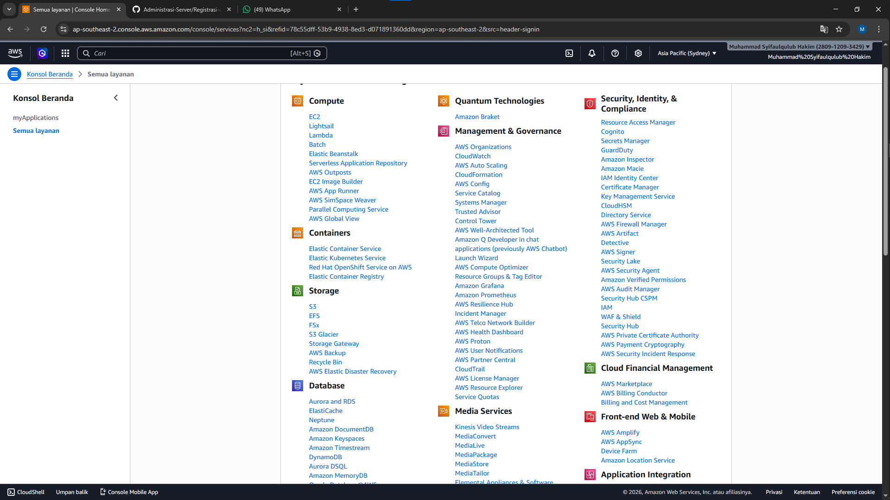
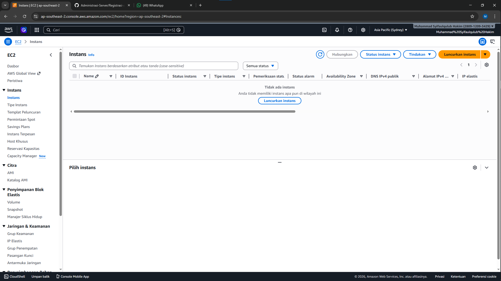
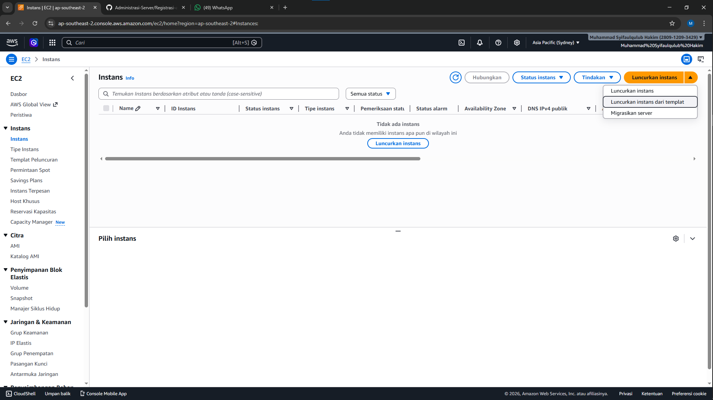
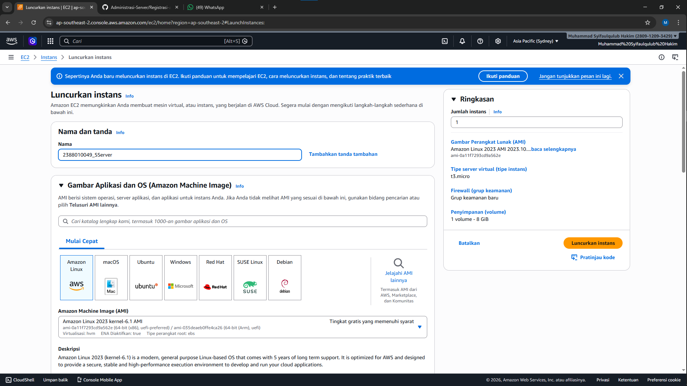
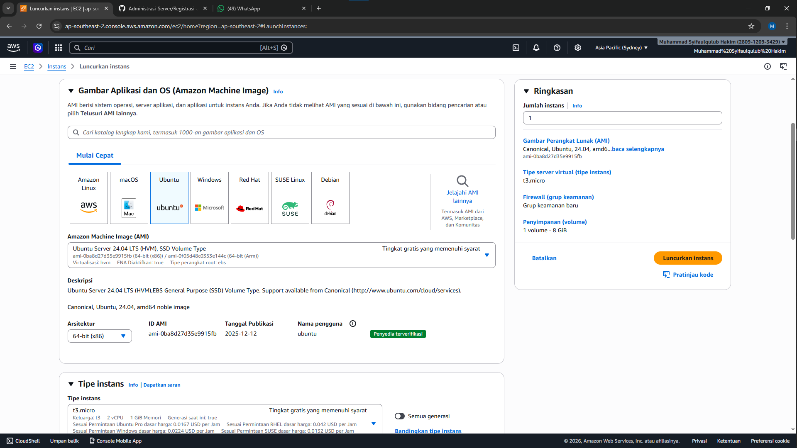
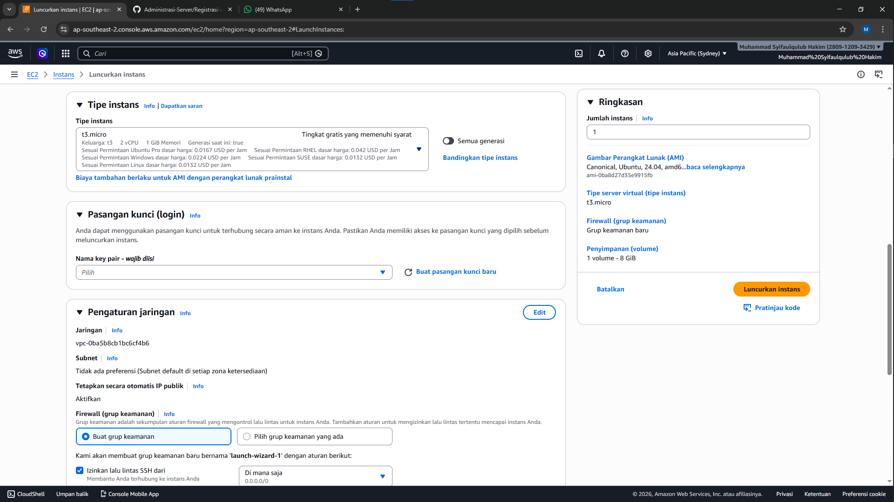
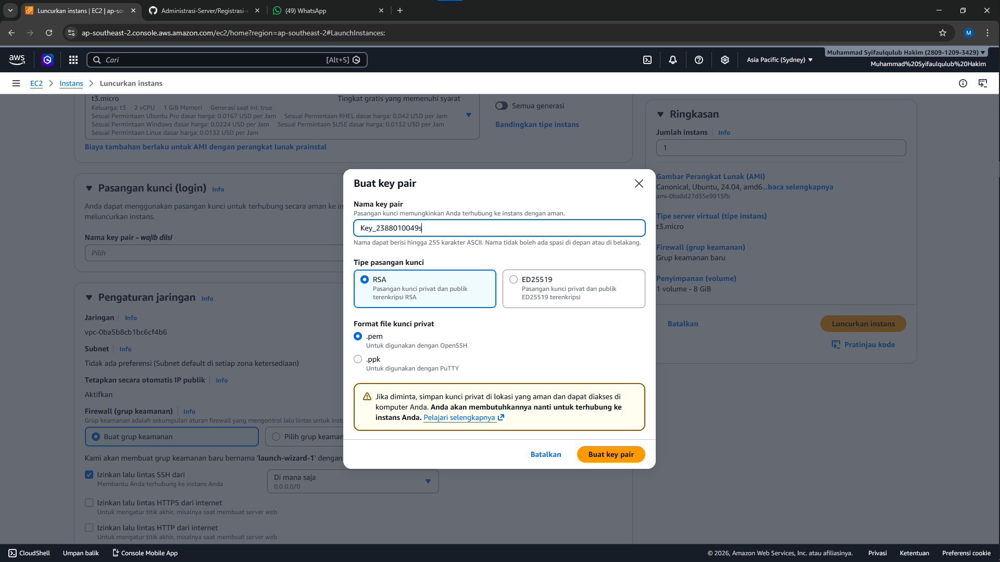
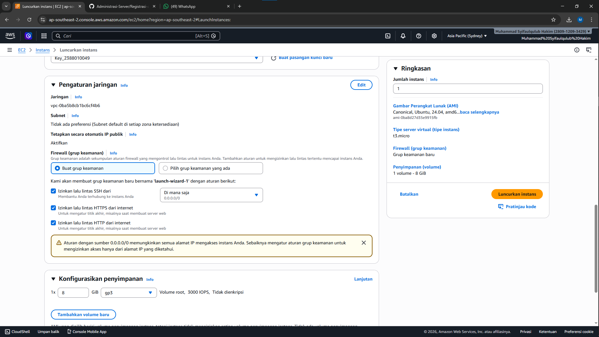
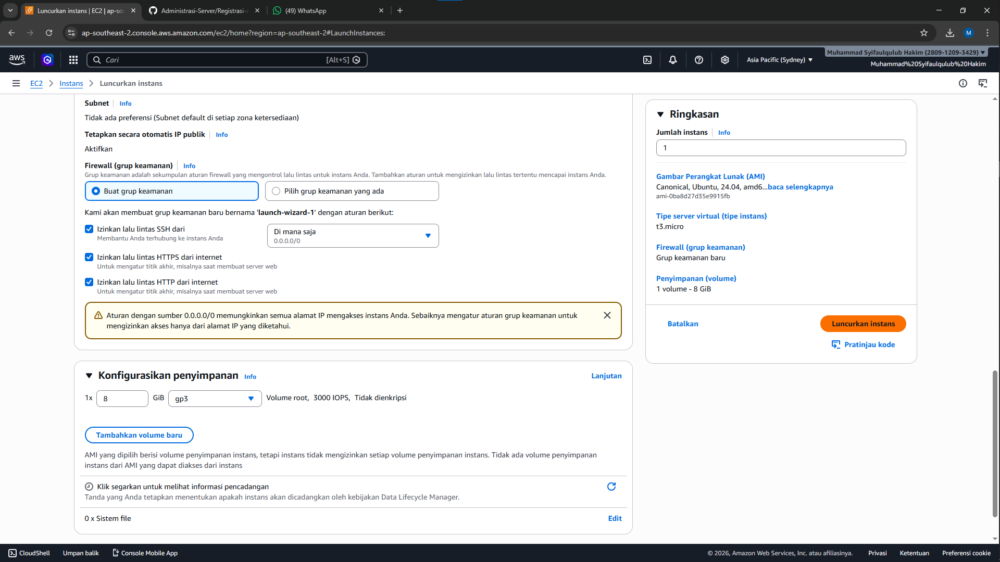
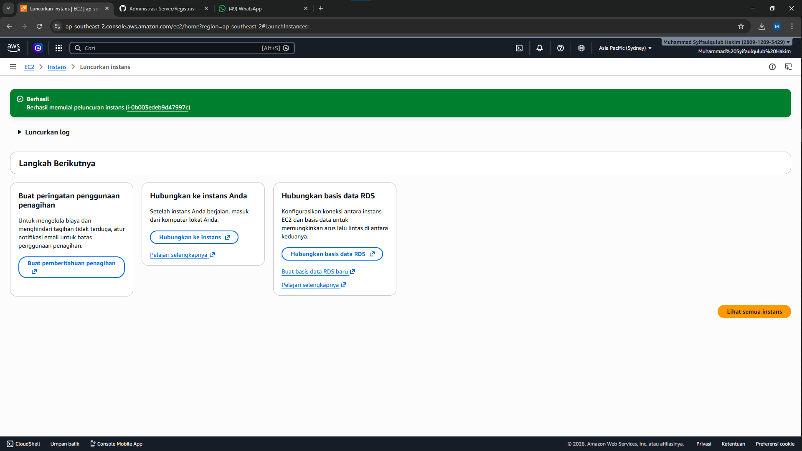

membuat ec2/ instace/ vm

1. plih menu ec2

2. didalam menu ec2 klik instace

3. didalam menu klik launc instace

4. beri nama instance dengan nama nim_Server

5.Pilih OS

6. Pilih resours type t3.micro

7. Membuat Key Pair

8. settimg kebijakan keamanan/ securty group
-Allow SSH -> membolehkan remote SSH dari luar
-Allow HTTPS -> artinya instance bisa diakses dari protocol HTTPS
-Allow HTTP -> artinya instance bisa diakses dari protocol HTTPS

9. Selesai setup pilih launch Instance

10. Pastikan Launch Sukses

