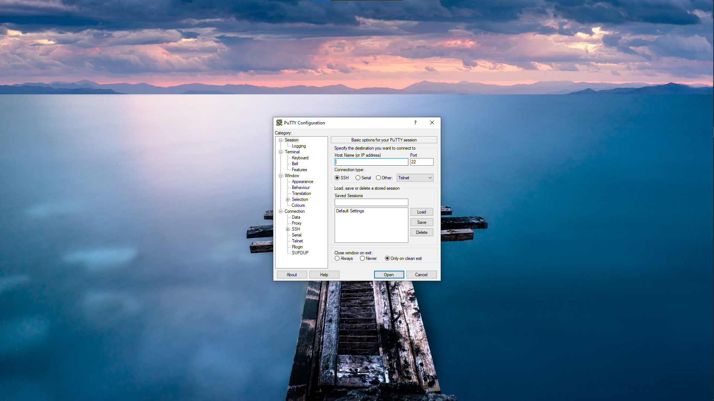
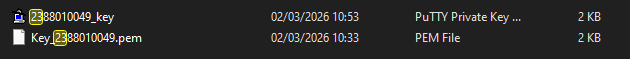
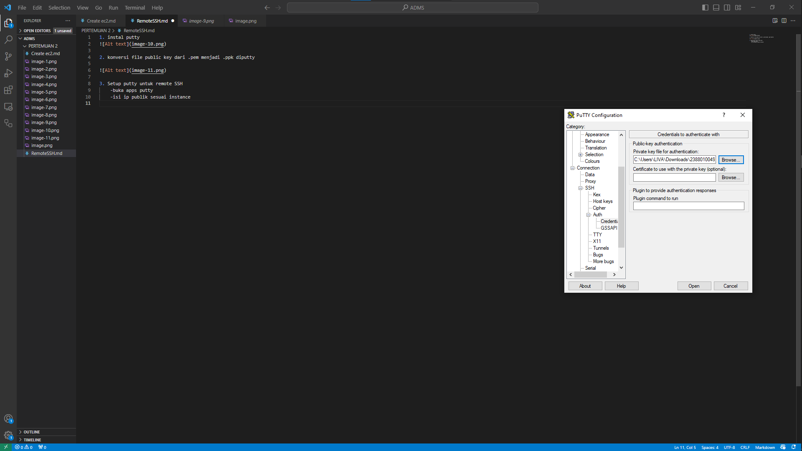
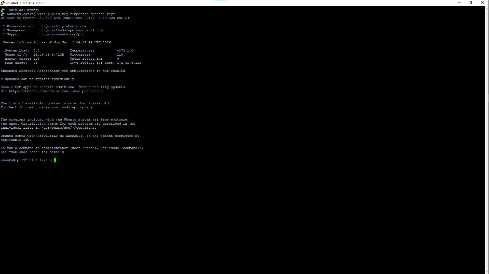
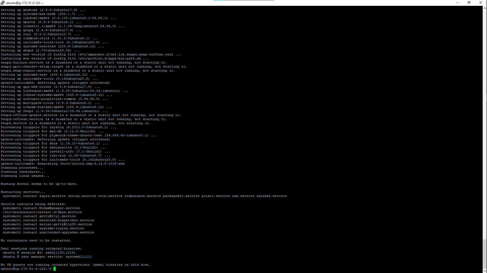
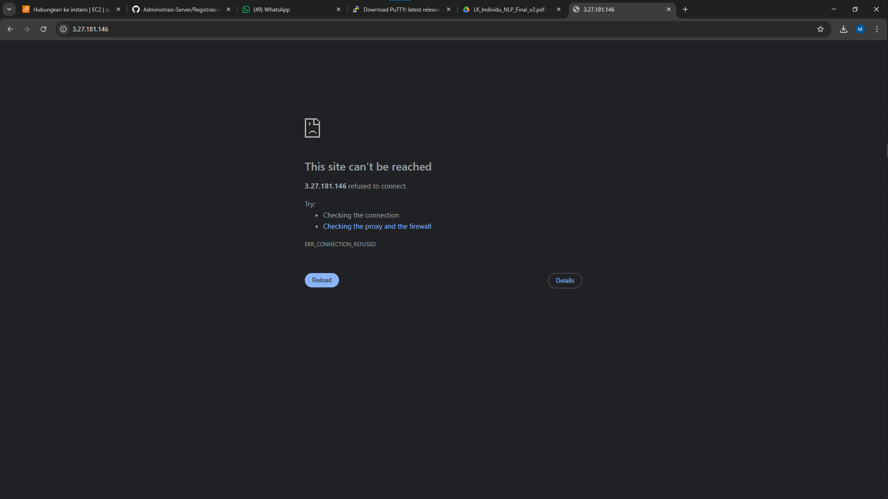
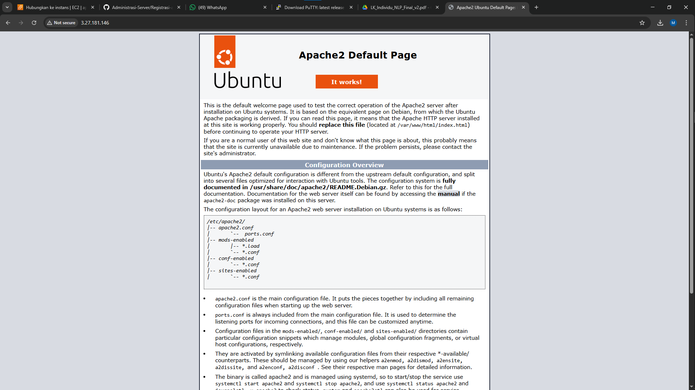
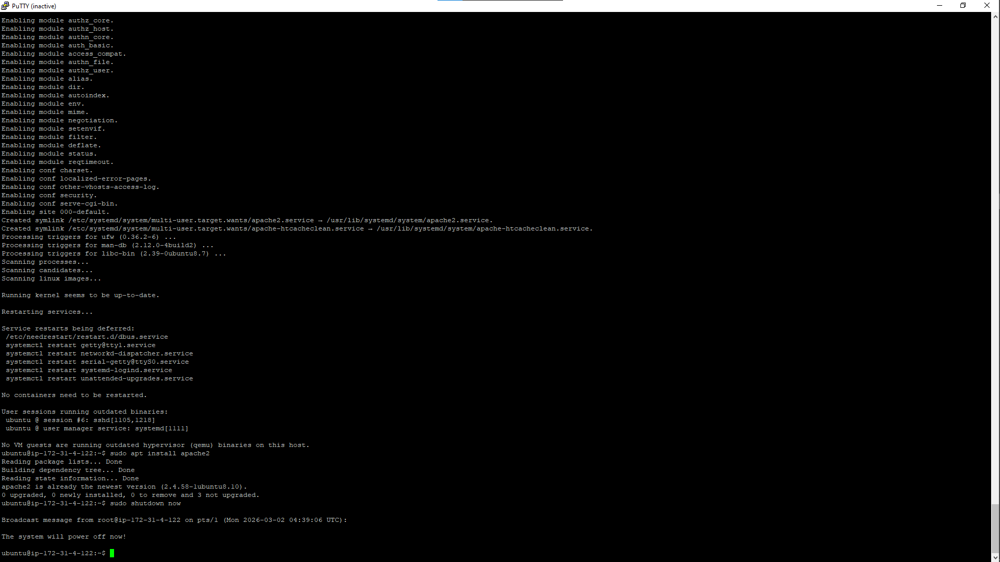

1. instal putty 

2. konversi file public key dari .pem menjadi .ppk diputty

3. Setup putty untuk remote SSH
    -buka apps putty
    -isi ip publik sesuai instance
    -isi port SSH
    -Load file klik -> SSH-> Auth -> Credential -> Uploud file key
    -lalu kembali ke sesion dan save

4. sudo apt-get update dan sudo apt-get update

5. Pembuktian Remote SSH secara fisual 

    - install apache
    - sudo apt install apache2
    - reload browser
    

6. Matikan instance agar tidak kena tagihan 
    sudo shutdown now

