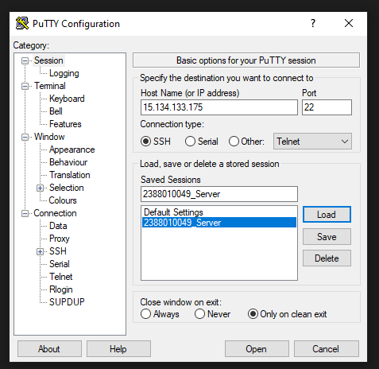
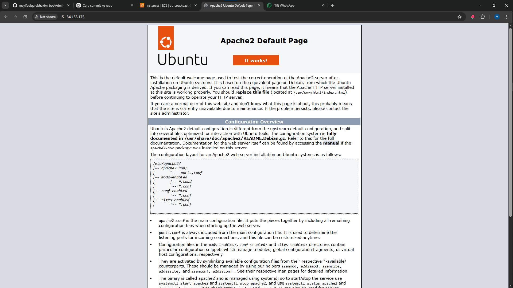
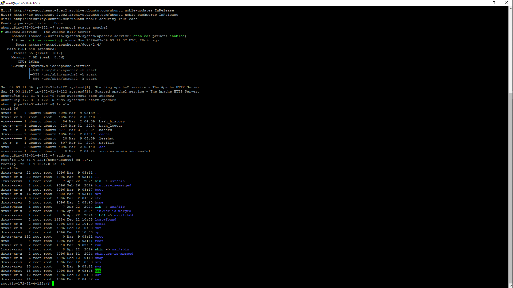
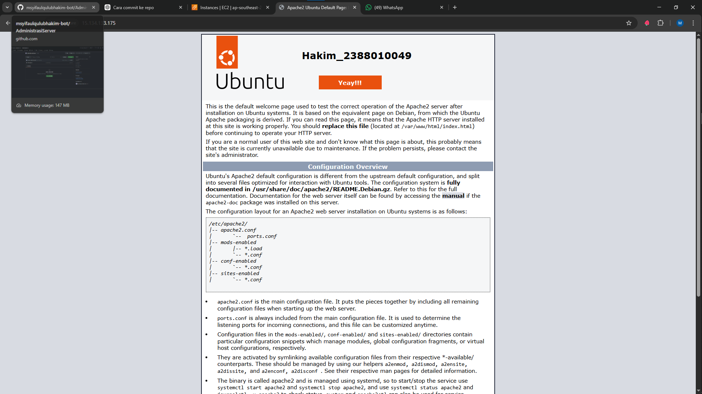

1. start instance 
2. buka putty
3. kemudian load save sesion yang disimpan pada pertemuan 2
4. update bagian ipaddres v4

5. sudo apt-get update untuk paching os linux server
6. cek webserver kita systemctl status apache2
7. stop web server sudo systemctl stop apache2
8. start ulang web server  sudo systemctl stop 

9. masukkkan command ls - untuk melihat directory tempat cursor actif
10. masukkan sudo su untuk masuk ke home 
11. masukkan cd../.. untuk ke roor folder ls -la

12. masuk ke var ke folder var ( cd var dengan cd var/www/html)
13. nano index.html untuk custom nama dan nim 

