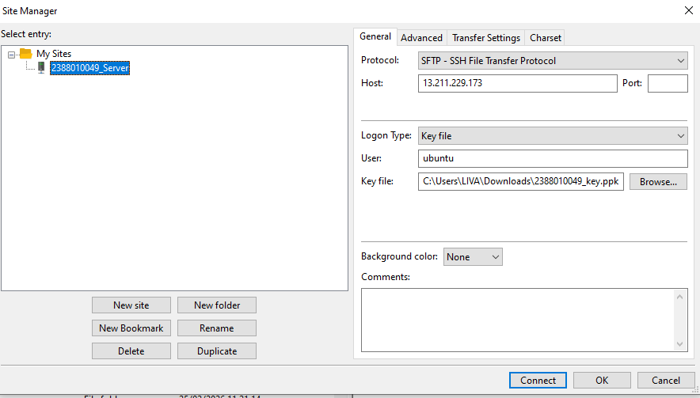
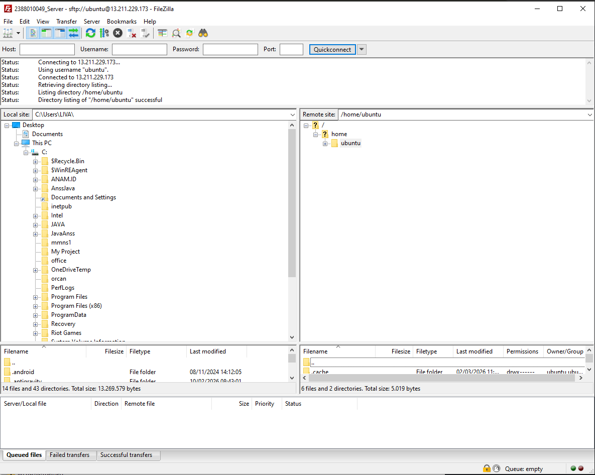
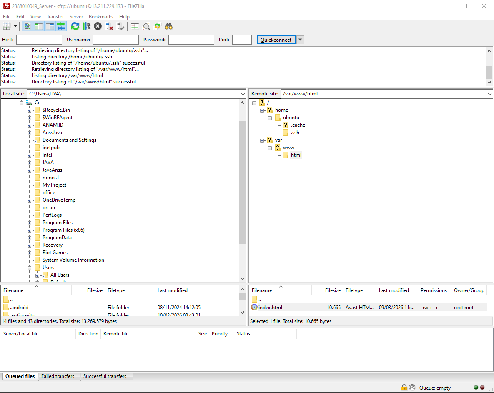
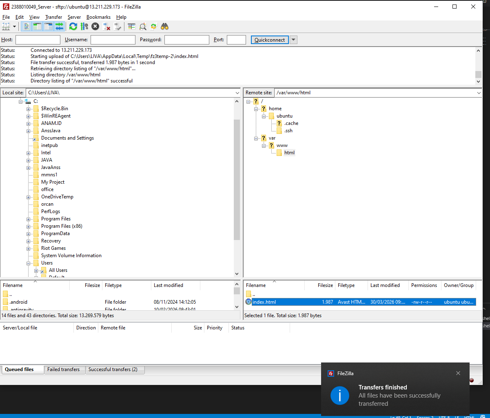
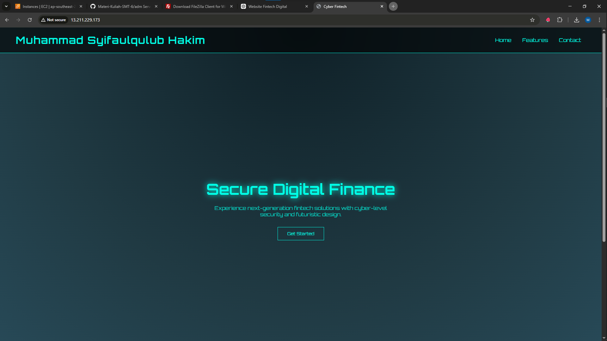

Memilih tools Migrasi File, misal kita akan gunakan Filezilla

unduh dan Install di https://filezilla-project.org/download.php?type=client
Buka Filezilla Client
Aktifkan Instance di AWS
Kembali ke FileZilla Client
Klik File > Site Manager
Klik New Site
Protocol > SFTP
Host > IP Public EC2
Port > 22
Logon Type > Key file
User > ubuntu
Key file > Pilih file .ppk / .pem yg didownload saat membuat instance
Klik Ok
CTRL + S
Klik Connect

Pada Dashboard utama fileZilla akan terbagi menjadi 2 panel

Panel Kiri > File Local (Komputer Anda)
Panel Kanan > File Server (AWS EC2)

Arahkan directory Cloud (Panel Kanan) ke Folder web server services area
/var/www/html

untuk solusi Permission Denied pada folder /var/www/html

Ubah Kepemilikan Folder
Mengubah folder /var/www/html agar bisa diakses oleh user 'ubuntu'
Sintaks: sudo chown -R ubuntu:ubuntu /var/www/html sudo chown -R ubuntu:ubuntu /var/www/html

Edit File index.html menjadi company Profile

Klik Kanan pada file index.html
Klik Edit
Edit File index.html menjadi company Profile

