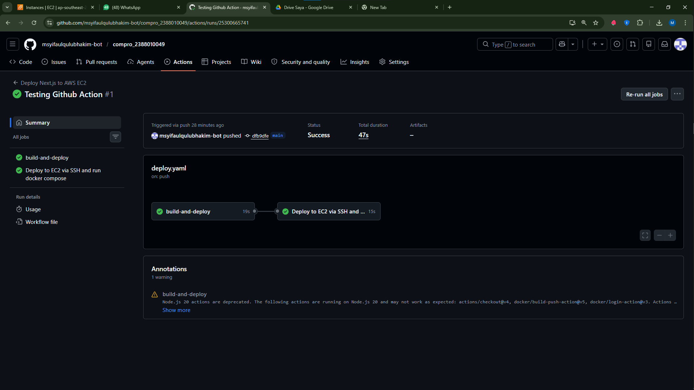
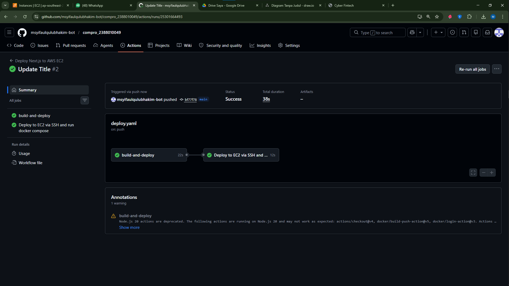
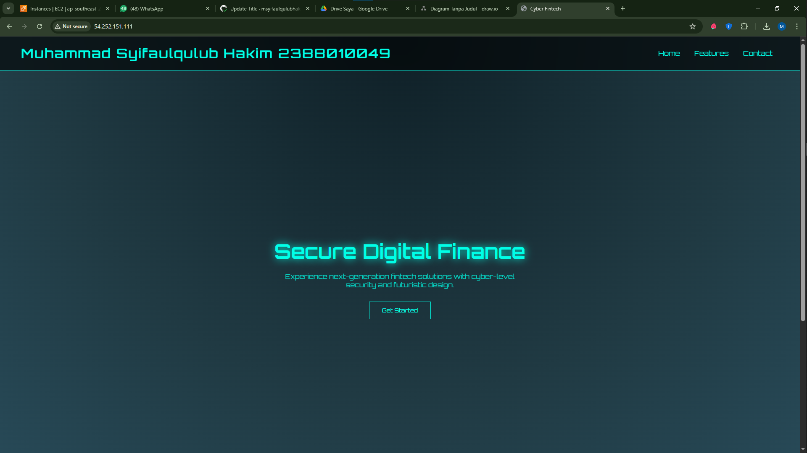

# Modernisasi CI/CD

1. Mengisi secret variable di github action 
    - buka repo github 
    - klik settings -> secret varibels -> action 
    - klik new repository secret
    - isi nama DOCKERHUB_USERNAME dan value =  username docker
    - klik new repository secret
    - isi nama = DOCKERHUB_TOKEN = token akun docker 
    - klik new repository secret
    - isi nama AWS_HOST dan value = IP addres ec2 instace public
    - klik new repository secret
    - isi nama = AWS_USERNAME dan value = ubuntu
    - klik new repository secret
    - sis nama = AWS_PRIVATE_KEY  dan value = file .pem

    

2. Melakukan edit file pipeline di github 
    - buka project comro_nim
    - buat folder baru  .GITHUB -> Buat folder WORKFLOWS -> Buat file DEPLOY.YAML
    - isi file DEPLOY.YAML SEBAGAI BERIKUT

    name: Deploy Next.js to AWS EC2
    on:
      push:
        branches: [ main ]
    jobs:
      build-and-deploy:
        runs-on: ubuntu-latest
        steps:
        - name: Checkout code
          uses: actions/checkout@v4
        - name: Login to Docker Hub
          uses: docker/login-action@v3
          with:
            username: ${{ secrets.DOCKERHUB_USERNAME }}
            password: ${{ secrets.DOCKERHUB_TOKEN }}
        - name: Build and push Docker image
          uses: docker/build-push-action@v5
          with:
            context: .
            push: true
            tags: ${{ secrets.DOCKERHUB_USERNAME }}/compro_nim:latest

        - name: Deploy to EC2 via SSH and run docker compose 
          uses: appleboy/ssh-action@v1.0.3
          with:
            host: ${{ secrets.AWS_HOST }}
            username: ${{ secrets.AWS_USERNAME }}
            key: ${{ secrets.AWS_PRIVATE_KEY }}
            port: 22
            script: |
            docker rm -f compro_nim
            docker pull ${{ secrets.DOCKERHUB_USERNAME }}/compro_nim:latest
            docker run -d --name compro_nim -p 80:80 ${{ secrets.DOCKERHUB_USERNAME }}/compro_nim:latest

3. pastikan sudah disable = sudo systemctl disable apache2
    pastikan sudah stop = sudo systemctl stop apache2
    Pastikan user ubuntu sudah ditambahkan ke docker = sudo usermod -aG docker ubuntu
    lalu commit github

    

4. update title 

    

    