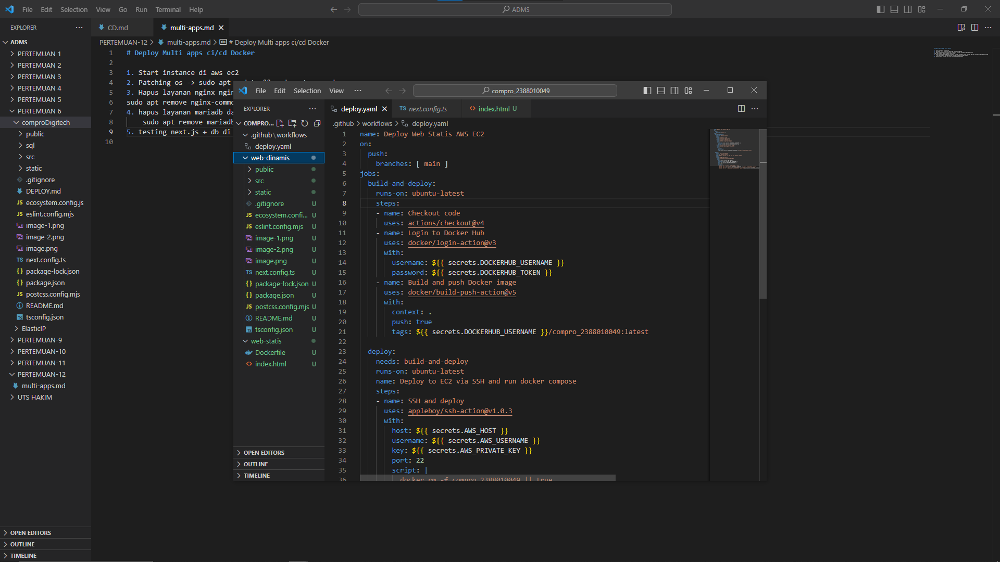
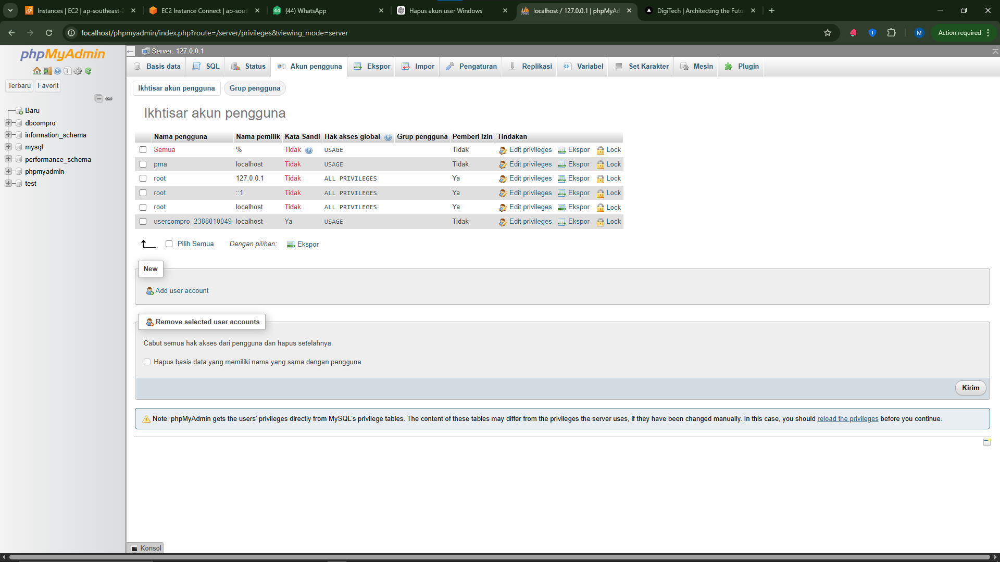
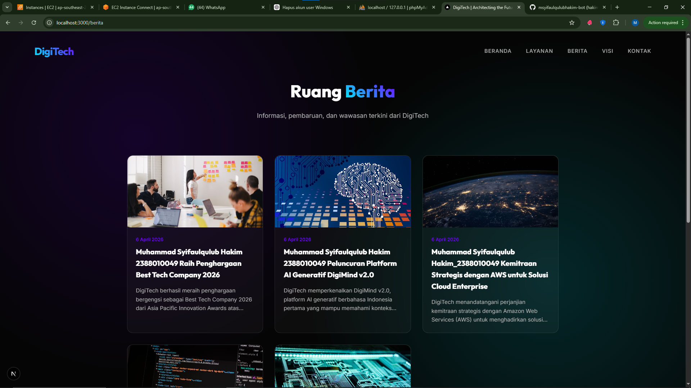

# Deploy Multi apps ci/cd Docker

1. Start instance di aws ec2
2. Patching os -> sudo apt update && sudo apt upgrade 
3. Hapus layanan nginx nginx dan uninstall -> sudo systemctl disable nginx
sudo apt remove nginx-common nginx-core 
4. hapus layanan mariadb dan uninstall -> sudo systemctl stop mariadb && sudo systemctl disable mariadb
    sudo apt remove mariadb-server mariadb-client mariadb-common
5. testing next.js + db di local enviroment menggunkanan
    - copy project digitech pada ptm6 kecuali folder .next, node_modules, sql kedalam folder web-dinamis
    
    - create user baru  bukan root DBMS (laragon, xampp , etc)
    
    - sesuaikan file .env
    - open-terminal -> cd web-dinamis
    - npm i
    - npm run dev ->
    