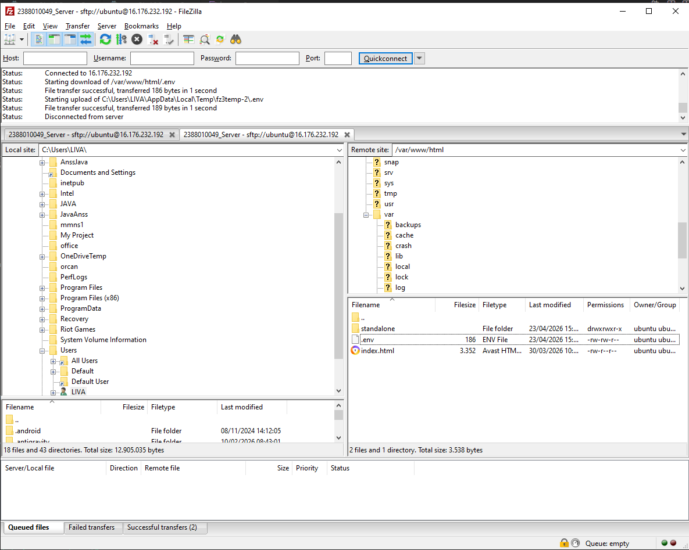
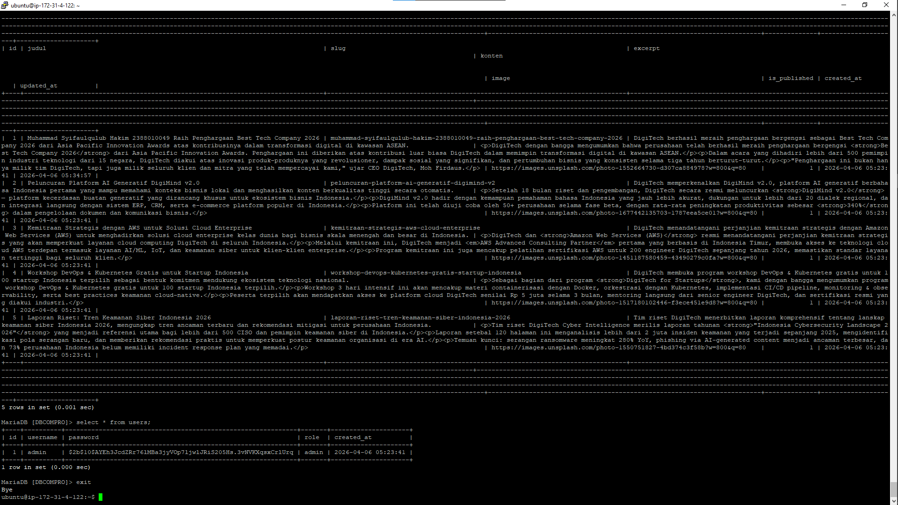
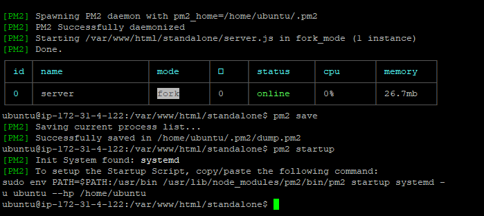
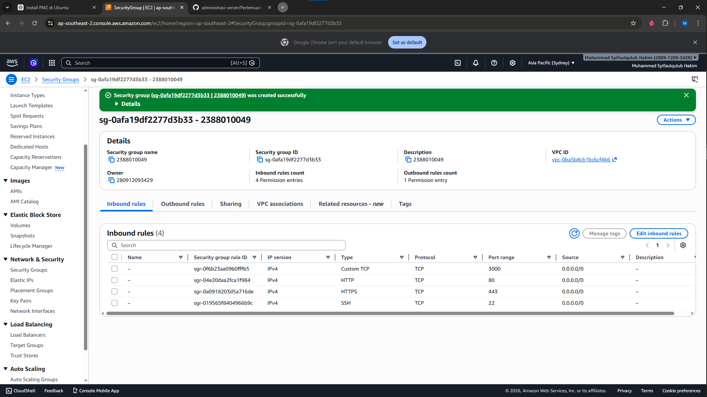
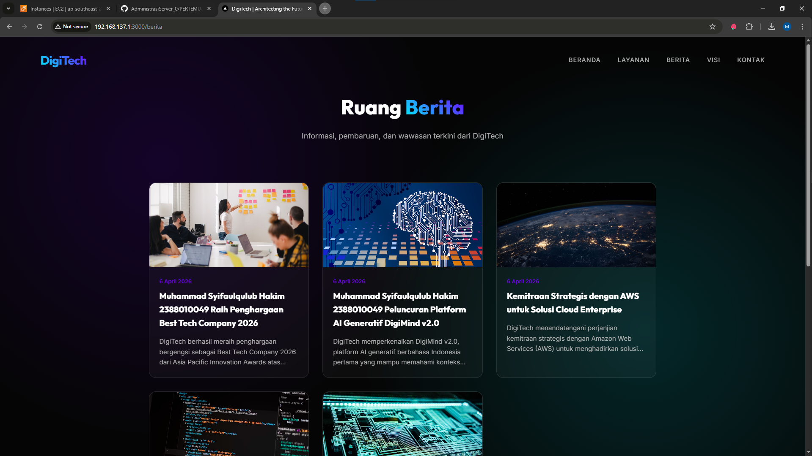

#. Migration web apps dynamic ke ec2 aws

Pastikan web apps dynamic sudah berjalan di local

jika sudah tanpa error kita akan membaut folder build

npm run build
pastikan menampilkan folder .next/standalone didalam tersedia folder static
Proses Upload File Folder StandAlone

lakukan proses archive pada folder .next/standalone dan folder public.zip
running instance -> connect open ssh -> open filezilla
upload file hasil archive .zip standalone ke ec2 AWS menggunakan Filezilla 

extract file hasil archive di ec2 aws
install tool unzip di ec2 aws
sudo apt install unzip -y
extract file hasil archive di ec2 aws
unzip standalone.zip
export dbCompro dari localhost import ke ec2 AWS
login ke SQL ec2 sudo mysql -u USERCOMPRO -p
use dbCompro;
copy paste query SQL dari export dbCompro di Localhost
cek setiap tabel aoakah sudah terisi
select * from berita;
select * from users;

sesuaikan isi dile .env di ec2 aws
DB_HOST=localhost
DB_USER=USERCOMPRO
DB_PASSWORD=PASSWORD
DB_NAME=dbCompro
ctrl s
di terminal ssh cd ke folder standalone run apps -pm2 start server.js -pm2 save -pm2 startup;

Buka port 3000 di security group ec2 aws

edit security group
add rule
save

cek perubahan alt 

